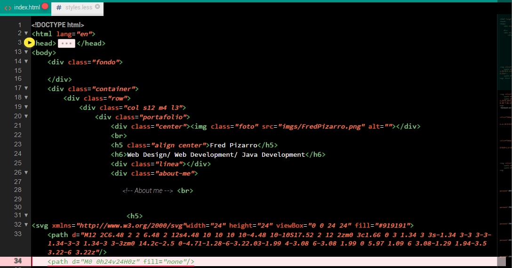
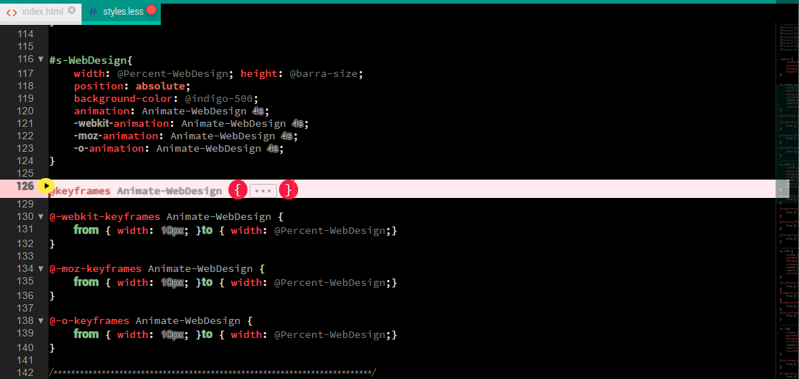
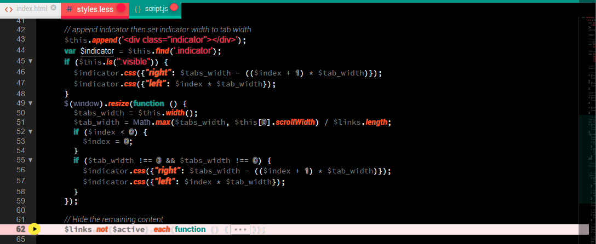
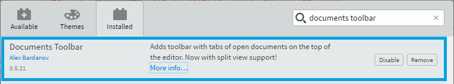

=======
# README
## This is the README for your extension "theme-color-coffee"
* Suggestions are accepted for design theme Material Color (dark) in Contact more info ...
* Version Mode light: Material Color (light) in  https://github.com/FredPizarro/theme-light-coffee-color
* Versions and Comment in http://brackets.dnbard.com/extension/theme-dark-coffee-color
 
## Manual mode
Clone a copy of the repo:

```
git clone https://github.com/FredPizarro/theme-dark-coffee-color.git
```

in you location `Brackets/extensions/user` under your user directory.

Depending on your platform, this folder is located here:
* **Windows** `%USERPROFILE%/AppData/Roaming/`
* **Mac** `$HOME/Library/Application Support/`
* **Linux** `$HOME/.config/`

As this location is under your user directory, the content is persisted across Code updates.

=======
# Images

#### view in html

#### view in CSS

#### view in javascript



=======
# Recommended Extensions:

### Toolbar
Require Install "Documents Toolbar" 

```
git clone https://github.com/dnbard/brackets-documents-toolbar.git
```


Repository : ( `https://github.com/dnbard` )

### Minimap
Require Install "Minimap" 

```
git clone https://github.com/zorgzerg/brackets-minimap.git
```


Repository : ( `https://github.com/websiteduck/brackets-wdminimap` )
Repository : ( `https://github.com/zorgzerg` )

=======
# Optional Extensions:

### Show Whitespace
A Brackets extension to visualize whitespace (both spaces and tabs)
in the same style as Sublime Text.
Repository : ( `https://github.com/DennisKehrig/brackets-show-whitespace` )

=======
# Contact
More contributions and suggestions in the theme to:

* E-mail:  Freddy_ps_3@hotmail.com
* Twitter: https://twitter.com/Fred_Pizarro

Copyright © 2015-2017 [MIT License](https://github.com/FredPizarro/theme-dark-coffee-color/blob/master/LICENSE/) by Fred Pizarro. 

**Enjoy!**
